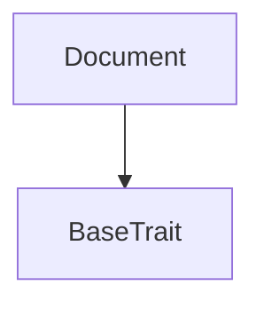

# TACT Compilation Report
Contract: Document
BOC Size: 4387 bytes

# Types
Total Types: 20

## StateInit
TLB: `_ code:^cell data:^cell = StateInit`
Signature: `StateInit{code:^cell,data:^cell}`

## Context
TLB: `_ bounced:bool sender:address value:int257 raw:^slice = Context`
Signature: `Context{bounced:bool,sender:address,value:int257,raw:^slice}`

## SendParameters
TLB: `_ bounce:bool to:address value:int257 mode:int257 body:Maybe ^cell code:Maybe ^cell data:Maybe ^cell = SendParameters`
Signature: `SendParameters{bounce:bool,to:address,value:int257,mode:int257,body:Maybe ^cell,code:Maybe ^cell,data:Maybe ^cell}`

## ChangeOwner
TLB: `change_owner#819dbe99 queryId:uint64 newOwner:address = ChangeOwner`
Signature: `ChangeOwner{queryId:uint64,newOwner:address}`

## ChangeOwnerOk
TLB: `change_owner_ok#327b2b4a queryId:uint64 newOwner:address = ChangeOwnerOk`
Signature: `ChangeOwnerOk{queryId:uint64,newOwner:address}`

## Deploy
TLB: `deploy#946a98b6 queryId:uint64 = Deploy`
Signature: `Deploy{queryId:uint64}`

## DeployOk
TLB: `deploy_ok#aff90f57 queryId:uint64 = DeployOk`
Signature: `DeployOk{queryId:uint64}`

## FactoryDeploy
TLB: `factory_deploy#6d0ff13b queryId:uint64 cashback:address = FactoryDeploy`
Signature: `FactoryDeploy{queryId:uint64,cashback:address}`

## ExclusiveRightsClaim
TLB: `_ author:address authorDetails:PersonDetails{name:^string,address:^string} amount:coins sentDocuments:bool viewedDocuments:bool = ExclusiveRightsClaim`
Signature: `ExclusiveRightsClaim{author:address,authorDetails:PersonDetails{name:^string,address:^string},amount:coins,sentDocuments:bool,viewedDocuments:bool}`

## SetPrice
TLB: `set_price#41231c75 price:Maybe coins = SetPrice`
Signature: `SetPrice{price:Maybe coins}`

## ClaimRequest
TLB: `claim_request#d54aa6e9 authorDetails:PersonDetails{name:^string,address:^string} = ClaimRequest`
Signature: `ClaimRequest{authorDetails:PersonDetails{name:^string,address:^string}}`

## ClaimApproval
TLB: `claim_approval#2e30fb06 assignmentHash:^string = ClaimApproval`
Signature: `ClaimApproval{assignmentHash:^string}`

## PersonDetails
TLB: `_ name:^string address:^string = PersonDetails`
Signature: `PersonDetails{name:^string,address:^string}`

## DocumentData
TLB: `_ author:PersonDetails{name:^string,address:^string} title:^string rootHash:^string data:^string tags:Maybe ^string description:Maybe ^string = DocumentData`
Signature: `DocumentData{author:PersonDetails{name:^string,address:^string},title:^string,rootHash:^string,data:^string,tags:Maybe ^string,description:Maybe ^string}`

## GetFunds
TLB: `get_funds#0a30a01f amount:coins = GetFunds`
Signature: `GetFunds{amount:coins}`

## SetCommissions
TLB: `set_commissions#4b486165 commissions:Commissions{transfershipCommissionPercentage:uint256,royaltyCommissionPercentage:uint256} documentAddress:Maybe address = SetCommissions`
Signature: `SetCommissions{commissions:Commissions{transfershipCommissionPercentage:uint256,royaltyCommissionPercentage:uint256},documentAddress:Maybe address}`

## Commissions
TLB: `_ transfershipCommissionPercentage:uint256 royaltyCommissionPercentage:uint256 = Commissions`
Signature: `Commissions{transfershipCommissionPercentage:uint256,royaltyCommissionPercentage:uint256}`

## DeclareDocument
TLB: `declare_document#4b36ff48 document:DocumentData{author:PersonDetails{name:^string,address:^string},title:^string,rootHash:^string,data:^string,tags:Maybe ^string,description:Maybe ^string} royaltyWalletAddress:Maybe address = DeclareDocument`
Signature: `DeclareDocument{document:DocumentData{author:PersonDetails{name:^string,address:^string},title:^string,rootHash:^string,data:^string,tags:Maybe ^string,description:Maybe ^string},royaltyWalletAddress:Maybe address}`

## CancelDocumentClaim
TLB: `cancel_document_claim#24a3641f documentAddress:address = CancelDocumentClaim`
Signature: `CancelDocumentClaim{documentAddress:address}`

## SetTheNextAutoproof
TLB: `set_the_next_autoproof#579c57d5 contractAddress:Maybe address = SetTheNextAutoproof`
Signature: `SetTheNextAutoproof{contractAddress:Maybe address}`

# Get Methods
Total Get Methods: 14

## currentCommissions

## currentTransfershipCommissionPercentage

## currentRoyaltyCommissionPercentage

## currentPrice

## currentClaim

## author

## exclusiveRightsOwner

## exclusiveRightsOwnerDetails

## royaltyWalletAddress

## documentData

## assignmentHash

## summedCommission

## transfershipCommission

## royaltyCommission

# Error Codes
2: Stack underflow
3: Stack overflow
4: Integer overflow
5: Integer out of expected range
6: Invalid opcode
7: Type check error
8: Cell overflow
9: Cell underflow
10: Dictionary error
13: Out of gas error
32: Method ID not found
34: Action is invalid or not supported
37: Not enough TON
38: Not enough extra-currencies
128: Null reference exception
129: Invalid serialization prefix
130: Invalid incoming message
131: Constraints error
132: Access denied
133: Contract stopped
134: Invalid argument
135: Code of a contract was not found
136: Invalid address
137: Masterchain support is not enabled for this contract
3861: Only author of the claim can approve
5175: Title hash can't be empty
7765: Can't approve without a claim
8086: Not enough funds
11428: Royalty commission percentage can't be greater than 1000
14555: Exclusive rights transfer is not available
16940: Only the exclusive rights owner can set the price
19061: Only exclusive rights owner can get funds
19102: Transfer is in progress
19201: Can't view documents if they are not sent
19858: Only owner can set the commissions
21449: Royalty commission percentage can't be less than 0
21953: Not enough funds.
23073: Can't approve if documents are not viewed
23942: Transfership commission percentage can't be less than 0
30316: Can't approve if documents are not sent
31093: Only owner can set the next autoproof address
31610: Transfership commission percentage can't be greater than 1000
34015: Only owner can cancel a document contract
40125: Author's address can't be empty
40368: Contract stopped
41504: Can't update without a claim
44565: Only the exclusive rights have access
45720: Can't reject if documents were sent but not viewed
48939: Only parent contract can set the commissions
53084: Author's name can't be empty
53296: Contract not stopped
59193: Only exclusive rights owner or author of the claim can reject
59485: Can't reject without a claim
61064: Data can't be empty
61678: Only owner can get funds
61716: Only the author of the claim have access
62718: RootHash hash can't be empty

# Trait Inheritance Diagram

# Contract Dependency Diagram

